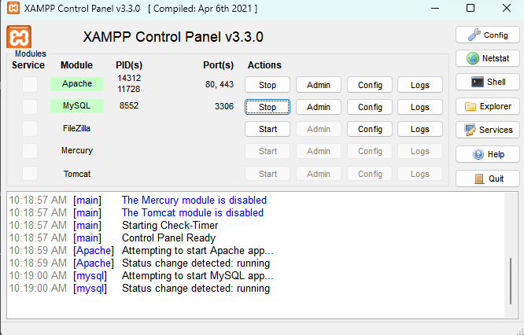
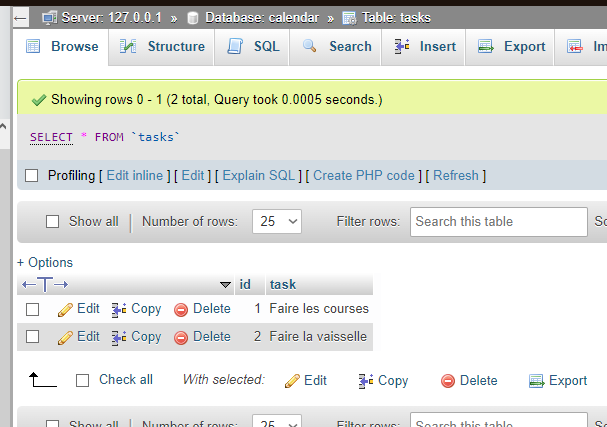
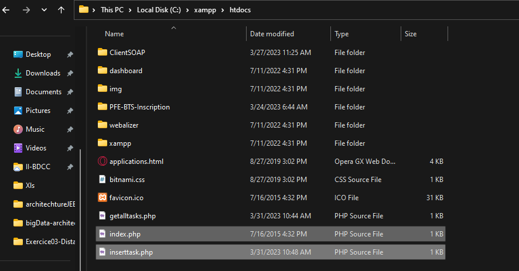

# Connexion à une base de données distante | Mutithreading 

## Objectif
Nous avons vu comment manipuler les données persistantes en utilisant une base de données locale. Dans ce chapitre, nous allons voir comment manipuler des données persistantes en utilisant une base de données distante.

Nous allons aussi voir comment utiliser le ***multithreading*** pour améliorer les performances de l'application.

## Prérequis 
Avant de commencer, on démarre ***XMPP*** et on lance le serveur ***Apache*** et la base de données ***MySQL***.



## 1. Création de la base de données
Le script SQL suivant permet de créer la base de données ***calendar*** et la table ***tasks***.

```sql
CREATE DATABASE calendar;
USE calendar;
CREATE TABLE tasks (
    id INT NOT NULL AUTO_INCREMENT,
    task VARCHAR(255) NOT NULL,
    PRIMARY KEY (id)
);
```

Nous pouvons maintenant insérer des données dans la table ***tasks***.

```sql
INSERT INTO tasks (task) VALUES ('Faire les courses');
INSERT INTO tasks (task) VALUES ('Faire la vaisselle');
```


## 2. Web services PHP
Nous allons maintenant créer un web service PHP appelé `getalltasks.php` qui permet de récupérer les données de la table ***tasks***.
```php
<?php
  DEFINE('DB_USERNAME', 'root');
  DEFINE('DB_PASSWORD', '');
  DEFINE('DB_HOST', 'localhost');
  DEFINE('DB_DATABASE', 'calendar');

  $mysqli = new mysqli(DB_HOST, DB_USERNAME, DB_PASSWORD, DB_DATABASE);

  if (mysqli_connect_error())
   {
    die('Connect Error ('.mysqli_connect_errno().') '.mysqli_connect_error());
    echo "Connection failed";
   }
  else
   {
    $sql="select * from tasks";
    $result=$mysqli->query($sql);
    $array=array();
      while ($raw=$result->fetch_assoc())
       {
        array_push($array,$raw);
        }
      echo json_encode($array);
    }

  $mysqli->close();
 ?>
```
Nous allons maintenant créer un web service PHP appelé `inserttask.php` qui permet d'ajouter une tâche dans la table ***tasks***.

```php
<?php
  DEFINE('DB_USERNAME', 'root');
  DEFINE('DB_PASSWORD', '');
  DEFINE('DB_HOST', 'localhost');
  DEFINE('DB_DATABASE', 'calendar');

  $mysqli = new mysqli(DB_HOST, DB_USERNAME, DB_PASSWORD, DB_DATABASE);
  if (mysqli_connect_error())
  {
    die('Connect Error ('.mysqli_connect_errno().') '.mysqli_connect_error());
    echo "Connection failed";
  }

    $task=$_POST['task'];
    $sql="INSERT INTO tasks(task) values('$task')";
    $result=$mysqli->query($sql);

      $resultJson["result"]=$result;
      echo json_encode($resultJson);

  $mysqli->close();
 ?>
```

On insère ces deux fichiers dans le répertoire ***htdocs*** du serveur ***Apache***.



## 3. Application Android
### 3.1. Autoriser l'accès internet à l'application

Dans le fichier ***AndroidManifest.xml***, on ajoute la ligne suivante dans la balise ***manifest***.

```xml
<uses-permission android:name="android.permission.INTERNET" />
```

### 3.2. Tester le web service ***getalltasks.php***

On crée la classe ***Task*** qui représente une tâche.

```java
public class Task {
    private int id;
    private String task;

    public Task(int id, String task) {
        this.id = id;
        this.task = task;
    }

    public int getId() {
        return id;
    }

    public String getTask() {
        return task;
    }
}
```

On crée l'interface ***myapi*** qui contient la méthode ***getTasks()***.

```java
public interface myapi {
    @GET("getalltasks.php")
    Call<List<Task>> getTasks();
}
```

Puis dans la classe ***MainActivity***, on ajoute le code suivant dans la méthode ***onCreate()***.
```java
 Retrofit retrofit = new Retrofit.Builder( ).baseUrl(url).addConverterFactory(GsonConverterFactory.create( )).build( );
myapi api = retrofit.create(myapi.class);

Call<List<Task>> call = api.getalltasks( );
call.enqueue(new Callback<List<Task>>( ) {
    @Override
    public void onResponse(Call<List<Task>> call, Response<List<Task>> response) {
        List<Task> data = response.body( );
        adapter = new ArrayAdapter<>(MainActivity.this, android.R.layout.simple_list_item_1, Listin(data));
        listTasks.setAdapter(adapter);
    }

    @Override
    public void onFailure(Call<List<Task>> call, Throwable t) {

    }
});
```
***Explication***
> **Retrofit** : permet de créer une interface qui permet de faire des requêtes HTTP.
> 
> **Listin()** : Méthode qui convertit une liste de tâches en une liste de chaînes de caractères.
> 
> **adapter** : permet de lier les données à la liste.
> 
> **listTasks** : liste qui affiche les tâches.
> 
> **enqueue()** : permet d'exécuter la requête HTTP en arrière-plan.
> 
> **onResponse()** : permet de récupérer les données de la requête HTTP.
> 
> **onFailure()** : permet de gérer les erreurs.
> 
> **Call<List<Task>>** : permet de faire une requête HTTP de type GET.
> 
> **getalltasks()** : méthode qui permet de récupérer les tâches.


Voici le résultat obtenu.

/Insérer image de l'éxecution//

## 4. Travail à faire
> Modifier l'application pour qu'elle permette d'ajouter une tâche dans la base de données distante.

Nous allons utiliser le code PHP suivant pour ajouter une tâche dans la base de données distante ***insertTask.php***, il représente le web service chargé de l'insertion coté serveur.

```php
<?php
  DEFINE('DB_USERNAME', 'root');
  DEFINE('DB_PASSWORD', '');
  DEFINE('DB_HOST', 'localhost');
  DEFINE('DB_DATABASE', 'calendar');

  $mysqli = new mysqli(DB_HOST, DB_USERNAME, DB_PASSWORD, DB_DATABASE);
  if (mysqli_connect_error())
  {
    die('Connect Error ('.mysqli_connect_errno().') '.mysqli_connect_error());
    echo "Connection failed";
  }

    $task=$_POST['task'];
    $sql="INSERT INTO tasks(task) values('$task')";
    $result=$mysqli->query($sql);

      $resultJson["result"]=$result;
      echo json_encode($resultJson);

  $mysqli->close();
 ?>
```

On ajoute le code suivant dans la classe ***MainActivity***, dans la méthode ***onCreate()***.

```java
btnAdd.setOnClickListener(new View.OnClickListener( ) {
    @Override
    public void onClick(View v) {
        String task = txtTask.getText().toString();
        Retrofit retrofit = new Retrofit.Builder( ).baseUrl(url).addConverterFactory(GsonConverterFactory.create( )).build( );
        myapi api = retrofit.create(myapi.class);
        Call<JsonObject> call = api.insertTask(task);
        call.enqueue(new Callback<JsonObject>( ) {
            @Override
            public void onResponse(Call<JsonObject> call, Response<JsonObject> response) {
                JsonObject data = response.body( );
                if (data.get("result").getAsBoolean( )) {
                    Toast.makeText(MainActivity.this, "Task added successfully", Toast.LENGTH_SHORT).show( );
                } else {
                    Toast.makeText(MainActivity.this, "Task not added", Toast.LENGTH_SHORT).show( );
                }
            }

            @Override
            public void onFailure(Call<JsonObject> call, Throwable t) {
                Toast.makeText(MainActivity.this, "Error", Toast.LENGTH_SHORT).show( );
            }
        });
    }
});
```

***Explication***
> **btnAdd** : bouton qui permet d'ajouter une tâche.
>
>**txtTask** : champ de saisie de la tâche.
>
> **insertTask()** : méthode qui permet d'ajouter une tâche dans la base de données distante.
>
> **onResponse()** : permet de récupérer les données de la requête HTTP.
>
> **onFailure()** : permet de gérer les erreurs.
>
> **Call<JsonObject>** : permet de faire une requête HTTP de type POST.
>
> **enqueue()** : permet d'exécuter la requête HTTP en arrière-plan.
>
> **GsonConverterFactory** : permet de convertir les données de la requête HTTP en objet JSON.
> 
> **JsonObject** : permet de récupérer les données de la requête HTTP.
>
> **Toast** : permet d'afficher un message à l'utilisateur.
