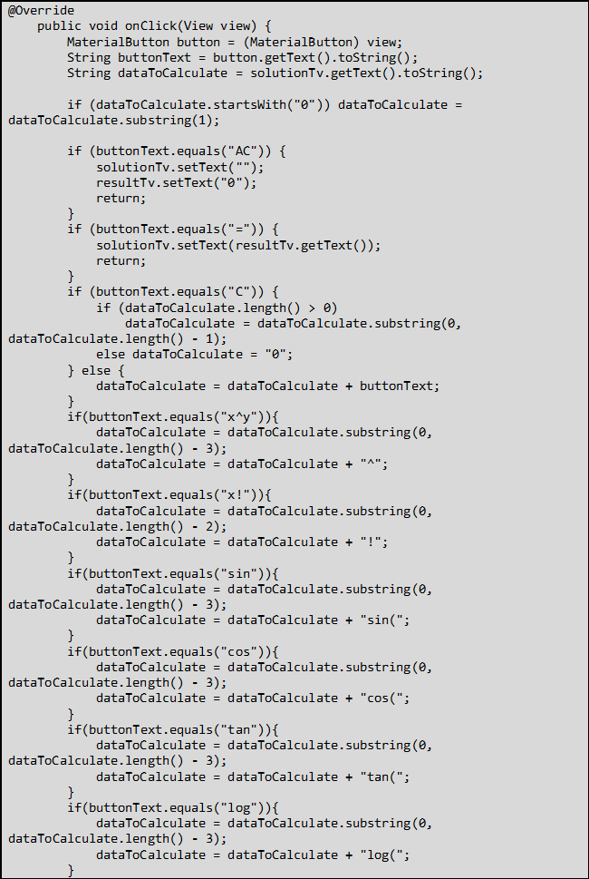
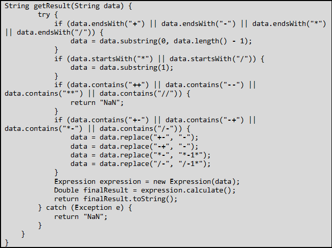

# Calculatice sientifique 

## Description
Ce projet vise à créer une calculatrice scientifique en utilisant Android Studio et Java.
On distingue 2 partie : 
- Partie 1 : interface graphique
    - Nous utiliserons Material Design pour créer les composants graphiques
    - Nous utiliserons le layout `RelativeLayout` pour positionner les composants
    - Nous utiliserons `TableLayout` pour organiser les boutons (Paysage)
- Partie 2 : code java
  - Nous utiliserons la librairie `mXparser` pour effectuer les calculs
  - Nous utiliseront les classes `Button` et `TextView` pour récupérer les données saisies par l'utilisateur
  - Nous utiliseront les classes `View.OnClickListener` pour gérer les événements

## Partie 2 : code java
On utilisera une seule classe `MainActivity` pour notre calculatrice.
### 1.	Définition des variables

```java
TextView resultTv, solutionTv;
MaterialButton buttonC, buttonBrackOpen, buttonBrackClose;
MaterialButton buttonDiv, buttonMult, buttonPlus, buttonMin, buttonEq;
MaterialButton button0, button1, button2, button3, button4, button5, button6, button7, button8, button9;
MaterialButton buttonFac, buttonSqrt, buttonPow, buttonLog, buttonLn, buttonSin, buttonCos, buttonTan,buttonPi, buttonE, buttonAns, buttonInv, buttonRad,buttonDeg;
MaterialButton buttonAC, buttonDot;
```
Puis on affect les éléments de l’interface et l’evenListner aux variables à travers la méthode assignID().
```java
void assignId(MaterialButton btn, int id) {
    btn = findViewById(id);
    btn.setOnClickListener(this);
}
```
### 2.	Définition des méthodes
On fait appel à cette méthode dans onCreate() :
```java
protected void onCreate(Bundle savedInstanceState) {
        super.onCreate(savedInstanceState);
        setContentView(R.layout.activity_main);

        {
            resultTv = findViewById(R.id.result_small);
            solutionTv = findViewById(R.id.result_tv);

            assignId(buttonC, R.id.button_c);
            assignId(buttonBrackOpen, R.id.button_open_bracket);
            assignId(buttonBrackClose, R.id.button_closed_bracket);
            assignId(buttonDiv, R.id.button_div);
            assignId(buttonMult, R.id.button_mult);
            assignId(buttonPlus, R.id.button_plus);
            assignId(buttonMin, R.id.button_min);
            assignId(buttonEq, R.id.button_eq);

            assignId(buttonAC, R.id.button_ac);
            assignId(buttonDot, R.id.button_dot);

            assignId(button0, R.id.button_0);
            assignId(button1, R.id.button_1);
            assignId(button2, R.id.button_2);
            assignId(button3, R.id.button_3);
            assignId(button4, R.id.button_4);
            assignId(button5, R.id.button_5);
            assignId(button6, R.id.button_6);
            assignId(button7, R.id.button_7);
            assignId(button8, R.id.button_8);
            assignId(button9, R.id.button_9);

            //Test if orientation changed
            if (savedInstanceState != null) {
                assignId(buttonSqrt, R.id.button_sqrt);
                assignId(buttonFac, R.id.button_fac);
                assignId(buttonPow, R.id.button_pow);
                assignId(buttonLog, R.id.button_log);
                assignId(buttonLn, R.id.button_ln);
                assignId(buttonSin, R.id.button_sin);
                assignId(buttonCos, R.id.button_cos);
                assignId(buttonTan, R.id.button_tan);
                assignId(buttonPi, R.id.button_pi);
                assignId(buttonE, R.id.button_e);
                assignId(buttonAns, R.id.button_ans);
                assignId(buttonInv, R.id.button_inv);
                assignId(buttonRad, R.id.button_rad);
                assignId(buttonDeg, R.id.button_deg);
            }
        }
    }
```
### 3.Garder les résultats après orientation
Un problème qui survient lors de l’orientation du mobile, c’est que la méthode onCreate est appelée à nouveau et donc on perd les valeurs de solutionTv et resultTv. Pour cela, on redéfinit la méthode `onSaveInstanceState()` pour sauvgarder ces valeurs et `onRestoreInstanceState()` pour les récupérer.
```java
@Override
protected void onSaveInstanceState(@NonNull Bundle outState) {
        super.onSaveInstanceState(outState);
        outState.putString("solution", solutionTv.getText().toString());
        outState.putString("result", resultTv.getText().toString());
        }
```
```java
@Override
    protected void onRestoreInstanceState(@NonNull Bundle savedInstanceState) {
        super.onRestoreInstanceState(savedInstanceState);
        savedInstanceState.getString("solution");
        savedInstanceState.getString("result");
    }
```
La première chose qu’on fera lors de l’appel de onCreate c’est recharger ces valeurs.

### 4. Méthode onCreate()
On va définir la méthode `onCreate()` qui va permettre de créer l’interface graphique.
```java
@Override
    protected void onCreate(Bundle savedInstanceState) {
        super.onCreate(savedInstanceState);
        setContentView(R.layout.activity_main);

        {…}//Assigning Ids block

        if (savedInstanceState != null) {
            String solution = savedInstanceState.getString("solution");
            solutionTv.setText(solution);
            String result = savedInstanceState.getString("result");
            resultTv.setText(result);
            savedInstanceState.clear();
        }
    }
```
### 5. Méthode onClick()
A chaque fois qu’on clique sur un bouton :
1-	On récupère l’expression
2-	On teste le bouton cliqué
3-	Si l’expression est calculable on fait appel à getResult
```java
@Override
    public void onClick(View view) {
        MaterialButton button = (MaterialButton) view;
        String buttonText = button.getText().toString();
        String dataToCalculate = solutionTv.getText().toString();

        if (dataToCalculate.startsWith("0")) dataToCalculate = dataToCalculate.substring(1);

        if (buttonText.equals("AC")) {
            solutionTv.setText("");
            resultTv.setText("0");
            return;
        }
        if (buttonText.equals("=")) {
            solutionTv.setText(resultTv.getText());
            return;
        }
        if (buttonText.equals("C")) {
            if (dataToCalculate.length() > 0)
                dataToCalculate = dataToCalculate.substring(0, dataToCalculate.length() - 1);
            else dataToCalculate = "0";
        } else {
            dataToCalculate = dataToCalculate + buttonText;
        }
        if(buttonText.equals("x^y")){
            dataToCalculate = dataToCalculate.substring(0, dataToCalculate.length() - 3);
            dataToCalculate = dataToCalculate + "^";
        }
        if(buttonText.equals("x!")){
            dataToCalculate = dataToCalculate.substring(0, dataToCalculate.length() - 2);
            dataToCalculate = dataToCalculate + "!";
        }
        if(buttonText.equals("sin")){
            dataToCalculate = dataToCalculate.substring(0, dataToCalculate.length() - 3);
            dataToCalculate = dataToCalculate + "sin(";
        }
        if(buttonText.equals("cos")){
            dataToCalculate = dataToCalculate.substring(0, dataToCalculate.length() - 3);
            dataToCalculate = dataToCalculate + "cos(";
        }
        if(buttonText.equals("tan")){
            dataToCalculate = dataToCalculate.substring(0, dataToCalculate.length() - 3);
            dataToCalculate = dataToCalculate + "tan(";
        }
        if(buttonText.equals("log")){
            dataToCalculate = dataToCalculate.substring(0, dataToCalculate.length() - 3);
            dataToCalculate = dataToCalculate + "log(";
        }
        if(buttonText.equals("ln")){
            dataToCalculate = dataToCalculate.substring(0, dataToCalculate.length() - 2);
            dataToCalculate = dataToCalculate + "ln(";
        }
        if(buttonText.equals("√")){
            dataToCalculate = dataToCalculate.substring(0, dataToCalculate.length() - 1);
            dataToCalculate = dataToCalculate + "sqrt(";
        }
        if(buttonText.equals("π")){
            dataToCalculate = dataToCalculate.substring(0, dataToCalculate.length() - 1);
            dataToCalculate = dataToCalculate + "pi";
        }
        if(buttonText.equals("e")){
            dataToCalculate = dataToCalculate.substring(0, dataToCalculate.length() - 1);
            dataToCalculate = dataToCalculate + "e";
        }
        if(buttonText.equals("Ans")){
            dataToCalculate = dataToCalculate.substring(0, dataToCalculate.length() - 3);
            dataToCalculate = dataToCalculate + "ans";
        }
        if(buttonText.equals("deg")){
            dataToCalculate = dataToCalculate.substring(0, dataToCalculate.length() - 3);
            dataToCalculate = dataToCalculate + "deg(";
        }
        if(buttonText.equals("Rad")){
            dataToCalculate = dataToCalculate.substring(0, dataToCalculate.length() - 3);
            dataToCalculate = dataToCalculate + "rad(";
        }

        solutionTv.setText(dataToCalculate);
        System.out.println(dataToCalculate);

        String finalResult = getResult(dataToCalculate);
        if (!finalResult.equals("NaN")) {
            resultTv.setText(finalResult);
        }

    }
```

### 6. Méthode getResult()
Cette méthode va permettre de calculer l’expression et de retourner le résultat.
Cette méthode ce charge de :
1-	Tester et corriger l’expression
2-	Convertir les texts des bouttons en text supporté par mXparser
3-	Renvoyer le résultat
```java
String getResult(String data) {
        try {
            if (data.endsWith("+") || data.endsWith("-") || data.endsWith("*") || data.endsWith("/")) {
                data = data.substring(0, data.length() - 1);
            }
            if (data.startsWith("*") || data.startsWith("/")) {
                data = data.substring(1);
            }
            if (data.contains("++") || data.contains("--") || data.contains("**") || data.contains("//")) {
                return "NaN";
            }
            if (data.contains("+-") || data.contains("-+") || data.contains("*-") || data.contains("/-")) {
                data = data.replace("+-", "-");
                data = data.replace("-+", "-");
                data = data.replace("*-", "*-1*");
                data = data.replace("/-", "/-1*");
            }
            Expression expression = new Expression(data);
            Double finalResult = expression.calculate();
            return finalResult.toString();
        } catch (Exception e) {
            return "NaN";
        }
    }
}

```
## Démonstration
